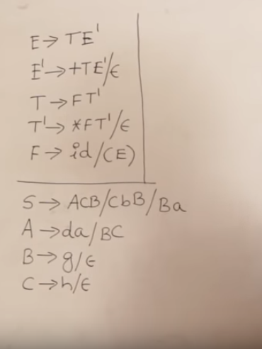

### 1.1 Finite automata
 - models for computers with an extremely limited amount of memory
 - Example could be swing doors (tænk på dsb togdøre)
 - CONTROLLER: State - Input
 - **Markov Chains**
 - **Formal Definition:** set of states, input alphabet, rules for moving, start state, and accept states
 - ```δ(x,1)=y``` (This rules says that, if we are in state x, and we receive a 1, we move to state y.)
```
A finite automaton is a 5-tuple (Q,Σ,δ,q0,F), where
1. Q is a finite set called the states,
2. Σ is a finite set called the alphabet,
3. δ: Q×Σ−→Q is the transition function,1
4. q0 ∈Q is the start state, and
5. F ⊆Q is the set of accept states.
```

For mere info om finite automaton, se section **1.6 s.36, sipser**.

**Formal definition (Condition1, 2, 3 of a finite automata example page 40 sipser.)**

*A language is called a regular language if some finite automaton recognizes it*

010110

### Regular operations
```
DEFINITION 1.23
Let A and B be languages. We define the regular operations union,
concatenation, and star as follows:
• Union: A ∪ B = {x| x ∈ A or x ∈ B}.
• Concatenation: A o B = {xy| x ∈ A and y ∈ B}.
• Star: A* = {x1x2 . . . xk| k >= 0 and each xi ∈ A}.
```
Example 1.24 in book:
```
Let the alphabet Σ be the standard 26 letters {a, b, . . . , z}. If A = {good, bad} and B = {boy, girl}, then
A ∪ B = {good, bad, boy, girl},
A o B = {goodboy, goodgirl, badboy, badgirl}, and
A* = {", good, bad, goodgood, goodbad, badgood, badbad,
goodgoodgood, goodgoodbad, goodbadgood, goodbadbad, . . . }.
```


### 1.2 Nondeterminism
NFA's will make multiple children or trees, and accept if one of the trees reaches and accept state.
NFAS = (Threading think of multithreading)
NFAS will accept if at least one of the children from the fork will end in an accept state. See **page 49 fig 1.28**

ε-arrows, often used for generating "or" situations. eg. example 1.33 in sipser, page 52. Acceptance of strings containing only 0s and being multiples of 2 **or** 3.


### Regular Expressions

Special characters:
```
. - matches anything
\<input> - finds the literal chatacter after the backslash, for example \. finds "."
\d - any digit (0-9)
\D - anything not a Digit(0-9)
\w - word character (aA-zZ, 0-9, _)
\W - not a word character
\s - whitespace
\S - not whitespace

---ANCHORS---
\b - word Boundary
\B - not a word boundary
^ - beginjning of a string
$ - end of a string

[] - Matches cahracters in brackets
[^ ] - matches characters NOT in brackets
| - either or
( ) - group

---QUANTIFIERS---
* - 0 or More
+ - 1 or More
? - 0 or One
{3} - Exact number (3)
{3,4} - Range of numbers (minimum, maximum)


```

### sed
Allows you to manipulate text-files, substitute stuff etc.   
Example: transform all t's in a textfile to T's:  
```sed 's/t/T/g' text```  
(g) stands for global, and will replace all t's in the text file. If you omitted the g, it would only replace the first occurence of t.  
sed will not modify the actual file, unless specified with -i. Example:  
```sed -i 's/t/T/g' text```

### awk
In AWK patterns are matched with "/ and ended with /". If we wanted to find a specific word in a file with AWK we could do this with:  
```awk '/<word>/ {print}' file```  
which would print every pattern with "word" in the file.  
If we wanted the second word prior to our pattern, we could do this with  
```awk '/<word>/ {print $2}' file```  
this would print the line matching our pattern, but omitting everything but the second item on the line.
We can use keyword ```BEGIN``` to execute something before the actual commands that we want in th ebody of the program. Example:  
```awk
BEGIN {print "Produce to pick up from the store:"}
/produce/ {print $2}
```
Similarly we can use keyword ```END``` to do something after all the other lines have been processed. Example:  

```awk
BEGIN {print "Produce to pick up from the store:"}
/produce/ {print $2}
END {print "-----------"}
```

We can specify a field seperator ```FS``` in the beginning keyword to specify a field seperator where the default might not be space " ".

```awk
BEGIN { FS=","
print "Produce to pick up from the store:"}
/produce/ {print $2}
END {print "-----------"}
```
This would be handy in case of CSV files.
*In addition to Regex, we can also use simple boolean expressions as lookup.*
We can also have more than 1 pattern to look for, so if we for example wanted to print every line with a qunaity greater than 1, given that we knew quantity was specified at address 3, and we also wanted to find everything that had product in it, we could simply do this as follows:  
```awk
BEGIN { FS=","
print "Produce to pick up from the store:"}
$3>1 {print $2}
/produce/ {print $2}
END {print "-----------"}
```

If we wanted to print every line, where the quantity is greater than 1, we could also use an if statement.

```
BEGIN { FS=","
print "Produce to pick up from the store:"}
{if($3>1)print $2}
END {print "-----------"}
```

use ```awk -f <awk-file> <file>``` to run awk-files on files.

awk example from exercisesSep27, ex. 10:
```awk
BEGIN{FS=","
sumT1=0
sumT2=0
sumT3=0
individual=0
tests=3
redTeam=0
blueTeam=0
greenTeam=0
print "Name    Average"
print "----    -------"}

{
  if (!($3==-1))
  {
  individual=($3+$4+$5)/tests
  print $1, individual
  }
  else
  {
    individual=($4+$5)/(tests-1)
    print $1, individual
  }
}

{
  if ($2 == "Red")
  {
    redTeam=redTeam+individual
  }
  else if ($2 == "Green")
  {
    greenTeam=greenTeam+individual
  }
  else if ($2 == "Blue")
  {
    blueTeam=blueTeam+individual
  }
}

{ if (!($3==-1)) sumT1=sumT1+$3} ## because we have 1 line with -1, so dont add
{ if (!($4==-1)) sumT2=sumT2+$4}
{ if (!($5==-1)) sumT3=sumT3+$5}

END{ print "------------"
print "Average", "Test 1", sumT1/(NR-1) ## hardcode because retard
print "Average", "Test 2", sumT2/NR
print "Average", "Test 3", sumT3/NR
print "------------"
print "Average, Red: ", redTeam/3
print "Average, Blue: ", blueTeam/2
print "Average, Green: ", greenTeam/3}
```
will give us
```
λ awk -f awkExercise.awk awkExercise.csv
Name    Average
----    -------
Tom 14.6667
Joe 13
Maria 15
Fred 13.3333
Carlos 19.5
Phuong 15.6667
Enrique 13
Nancy 15
------------
Average Test 1 5
Average Test 2 15.75
Average Test 3 22.125
------------
Average, Red:  16.3889
Average, Blue:  14.1667
Average, Green:  13.8889
```

### Compilers
Phases of a compiler, and interfaces between them:  
  

Two of the most useful abstractions used in modern compilers are CFG's for parsing, and regular expressions for lexical analysis.  
**Yacc**(bison): Converts a grammar into a parsing program  
**Lex**(flex): converts a declarative specification into a lexical analysis program.  


**COMPILER PHASES**  


**Simpler version**  


**Example grammar (CFG)**  


**Example of parse tree in compiler, using grammar above**


Implementation of this in C, and more guidelines on page 10-11, appel.  

**Lexical Tokens**:  
A sequence of characters that can be treated as a unit in the grammar of a programming language.  
```
Examples:

Type
----
ID      | foo n14 last
NUM     | 73  0   0   515   082
REAL    | 66.1  .5  10.  1e67   5.5e-10
IF      | if
COMMA   | ,
NOTEQ   | !=
LPAREN  | (
RPAREN  | )
```
Lexical tokens = how we store the tokens the compiler should understand. This is put  into a header file, and used in the scanner.

An example of a scanner in C, implemented from the Lexical tokens defined above:  

```c
/* C Declarations: */
#include "tokens.h" /* definitions of IF, ID, NUM, ... */
#include "errormsg.h"
union {int ival; string sval; double fval;} yylval;
int charPos=1;
#define ADJ (EM_tokPos=charPos, charPos+=yyleng)
%}
/* Lex Definitions: */
digits [0-9]+
%%
/* Regular Expressions and Actions: */
if                                      {ADJ; return IF;}
[a-z][a-z0-9]*                          {ADJ; yylval.sval=String(yytext);
                                          return ID;}
{digits}                                {ADJ; yylval.ival=atoi(yytext);
                                          return NUM;}
({digits}"."[0-9]*)|([0-9]*"."{digits}) {ADJ;
                                          yylval.fval=atof(yytext);
                                          return REAL;}
("--"[a-z]*"\n")|(" "|"\n"|"\t")+      {ADJ;}
.                                      {ADJ; EM_error("illegal character");}
```

Lex is a scanner that interprets a DFA and executes defined action fragments on each match. The action statements just returning the tokens from the header file in ```tokens.h```
More information about lex on page 31, appel in terms of what the specific sections does and declares.

Another flex example(From lecture):

```c
%{
#include <stdio.h>
%}

%option noyywrap

%%
[ \t\n]+        printf("white space, length %i\n",yyleng);

"*"             printf("times\n");
"/"             printf("div\n");
"+"             printf("plus\n");
"-"             printf("minus\n");
"("             printf("left parenthesis\n");
")"             printf("right parenthesis\n");

0|([1-9][0-9]*) printf("integer constant: %s\n",yytext);
[a-zA-Z_][a-zA-Z0-9_]* printf("identifier: %s\n",yytext);

.               printf("illegal char %s\n",yytext);
%%
void main() {
  yylex();
}
```
Running the scanner above example:  
```
(08:36) Programs> dir
total 4
-rw------- 1 538 Sep 11 08:15 first.l
(08:37) Programs> flex first.l
(08:37) Programs> dir
total 52
-rw------- 1   538 Sep 11 08:15 first.l
-rw-r--r-- 1 45478 Sep 11 08:37 lex.yy.c
(08:37) Programs> gcc lex.yy.c
(08:37) Programs> dir
total 76
-rw------- 1   538 Sep 11 08:15 first.l
-rw-r--r-- 1 45478 Sep 11 08:37 lex.yy.c
-rwxr-xr-x 1 23592 Sep 11 08:37 a.out
(08:37) Programs> ./a.out
a*(b-17) + 5/c
identifier: a
times
left parenthesis
identifier: b
minus
integer constant: 17
right parenthesis
white space, length 1
plus
white space, length 1
integer constant: 5
div
identifier: c
```  
Counting lines/chars example:  
```c
%{
int lines = 0, chars = 0;
%}

%option noyywrap

%%
\n     lines++; chars++;
.      chars++;

%%
int main(){
  yylex();
  printf("#lines = %i, #chars = %i\n", lines, chars);
}
```

The scanner for the ```scil``` compiler can be found in ```lexer_parser.py```


### Context-Free grammar.
#### small introduction (from book)
Most compilers and interpreters contain a component called a **parser** that  extracts the meaning of a program prior to generating the compiled code or performing the intepreted execution.  
The collection of languages associated with context-free grammars are called the context-free languages. They include all the regular languages and many additional languages.  

Example of context free grammar *G1*:
```
A -> 0A1
A -> B
B -> #
```
A grammar consists of a collection of **substitution rules**, or **productions**.

G1 contains:  
- 3 rules  
- 2 variables **A** and **B**
- *Start variable* **A**
- 3 *terminals* **0, 1, #**

The sequence of substitutions to obtaina  string is called a derivation. An example derivation of G1 to obtain **000#111**

```
A -> 0A1 -> 00A11 -> 000A111 -> 000B111 -> 000#111.
```
A parse tree can also be used to visualize the derivation:


Example of context free grammar from a fragment of the English language can be seen on p. 103 in sipser.

```
DEFINITION 2.2
A context-free grammar is a 3-tuple (V,Σ,R,S) where
  1. V is a finite set called the variables,
  2. Σ is a finite set, disjoint from V, called the terminals
  3. R is a finite set of rules, with each rule being a variable and a string of variables and terminals, and
  4. S ∈ V is the start variable
```
Example of defition 2.2:
```
Consider grammar G3 = ({S}, {a,b}, R, S). The set of rules, R is
  S -> aSb | SS | ε
```
#### Designing a CFG
If we canted to get a grammar for the language {0^n1^n|n>=0}∪{1^n0^n|n>=0},

Split them into two, generating language **S1**, **S2**. First,  
```S1 -> 0(S1)1 | ε```  
then,   
```S2 -> 1(S2)0 | ε```  
Then we add the rule  
```S -> S1 | S2```  
to give us:  
```
S -> S1 | S2
S1 -> 0(S1)1 | ε
S2 -> 1(S2)0 | ε
```  
If a grammar can generate the same string in several different ways, we say that the string is derived **ambiguously**. This means the grammar is **ambiguous**.  
Example on page 108, sipser.  
NOTE: 2 DIFFERENT *PARSE TREES*, not derivations necessarily.


#### Chomsky Normal form
Example can be seen on page 110, sipser.


### Parsing


"The way in which words are put together to form phrases, clauses, or sentences."  

Left-most vs right-most derivation.  
Parse tree examples page 43.

Parsers must read not only terminal symbols such as +, -, num and so on, but also the *end-of-file* marker. ($)


#### Recursive Descent (predictive)
Parsing with this method only works on grammars where the first terminal symbol of each subexpressions provides enough information to choosse which production to use.  
Example of success and fail on page 47, appel.

#### First and Follow sets.  
For at finde FIRST, finder vi FIRST(A) af alle variabler.  
For at finde FOLLOW, følger vi disse regler:  
  1. If A is start symbol, put $ in FOLLOW(A)  
  2. Hvis A står før variabel/terminal, tager man first af den efter,  
      FOLLOW(A) = FIRST(β)  
  3. Hvis A ikke har nogen variabel/terminal efter sig, tager man follow af den variabel den er inkluderet i.  
      Add FOLLOW(A)=FOLLOW(B)  

  MAN SKRIVER IKKE EPSILON I FOLLOW. EPSILON ERSTATTER/fjerner DEN GAMLE VARIABEL.

Eksempel fra youtube:

HVIS EPSILON ER EN DEL AF SÆTTET FJERNER DET ORIGINALEN OG MAN KØRER IGEN



```
First(E) = {id, (}
First(E') = {+, eps}
First(T) = {id, (}
First(T') = {*, eps}
First(F) = {id, (}

FOLLOW(E) = {$, )}
FOLLOW(E') = {$, )}
FOLLOW(T) = {+, $, )}
FOLLOW(T') = {+, $, )}
FOLLOW(F) = {*, +, $, )}


FIRST(S) {d,g,h,eps,b,a}
FIRST(A) = {d, g, h, eps}
FIRST(B) = {g, eps}
FIRST(C) = {h, eps}

FOLLOW(S) = {$}
FOLLOW(A) = {h, g, $}
FOLLOW(B) = {$, a, h, g}
FOLLOW(C) = {g, $, b, h}
```

LL1 Construction fra youtube:


Hvordan en LL1 parser virker på stacken(Han er ved at strege ( over fordi der er match med input), ellers laver han lookup i tabellen):


LL1 is only accepted when we only have at most one construction in a parsing table column. Check if one variable has multiple productions that give same results. Example of youtube:


### LR(0)
LR(0) Parsing table construction example:  


Example from book:  
Rules:  
examplerules.PNG)
bookexample.PNG)

How LR(0) works on the stack:  
stack.PNG)

If there are conflicting entries, the grammar is not LR(0), which means we could use SLR. The only difference to this is that we put reduce actions into where indicated by the FOLLOW set.

LR(1) = LR(0) + lookahead! NOTHING ELSE. Lookahead doesnt change when making transitions, but they change when you specify closures.

IN CLR(1) in comparison to LR(0) and SLR(1), we will place reductions in the lookahead, whereas in LR(1) we place them in the whole row for the state, and in SLR we only place them in the follow up set of the rule.

LR(1) and LALR(1) Is pretty much the same, the only difference is that u merge identical states, ignore the lookahead sets.

Example of LR(1) states from youtube:  
Example.PNG)

Making this LALR(1) Would mean we merge the states that are the same (ignoring lookaheads) LALR examples on page 66 appel.

### Parser-generators (Yacc/Bison)

A Yacc specification is divided into three sections, separated by %% marks:
```
parser declarations
%%
grammar tules
%%
programs
```

Example of yacc implementation for grammar 3.30, page 69, appel:

```c
%{
int yylex(void);
void yyerror(char *s) { EM_error(EM_tokPos, "%s", s); }
%}
%token ID WHILE BEGIN END DO IF THEN ELSE SEMI ASSIGN
%start prog
%%

prog: stmlist

stm : ID ASSIGN ID
    | WHILE ID DO stm
    | BEGIN stmlist END
    | IF ID THEN stm
    | IF ID THEN stm ELSE stm

stmlist : stm
        | stmlist SEMI stm
```
Yacc reports shift-reduce and reduce-reduce conflicts, to indicate that the grammar may not be as expected.

Yacc has **precedence directives** that allow us to specify which operations and symbols have higher priority.

Yacc example with reduce reduce conflict:

Grammar:
```
S → id := E
E → id
E → E & E
E → E = E
E → E + E
```


```c
%{ declarations of yylex and yyerror %}
%token ID ASSIGN PLUS MINUS AND EQUAL
%start stm
%left OR
%left AND
%left PLUS
%%

stm : ID ASSIGN ae
    | ID ASSIGN be

be : be OR be
   | be AND be
   | ae EQUAL ae
   | ID

ae : ae PLUS ae
   | ID
```


#### AST
Example of how an AST would look in a compiler:  
from wiki  


Vi bruger denne i vores sematiske analyse, for at se om alt stemmer overens, når vi går igennem et udtryk. Både mht typechecking, og symbolcollection. Dvs hvis en type er assignet forkert, er det vores AST der findes fejlen. Hvis er symbol allerede er defineret med samme navn i nuværende scope, er det ASTen der smider fejlen. Det er også AST'en der sørger for at tilføje ukendte symboler til vores symbol table.


### Symbol tables
To keep track of where names are available, which instance of a name we are
talking about, and where it may be found, we collect this information and organize
it into what is called a **symbol table**.

In C, hash table for each scope, defining what resources are available.
In Python (SCIL) We use the built-in dictionary.

### Symbol collection  
Traverser AST'en og indsætter nødvendige data ind i symbol table. Hvis Symboler allerede er defineret i samme scope smider den en error. Dette kan også ses i SCIL compileren.

### Invariants
Something that you can guarantee wont change in a program, no matter how you use it. If we are invariant, we wont change. Hammer, Saw example from youtube. Once a program/function returns, it must put everything back together.
